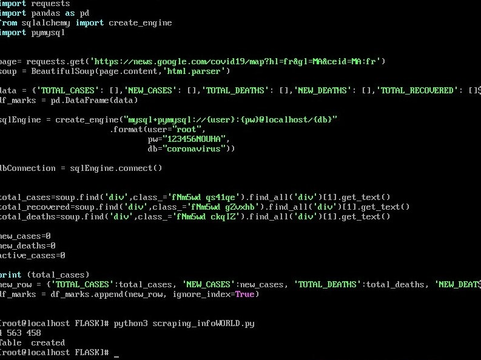
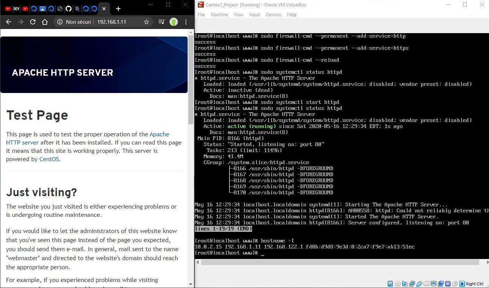

# CovidApp
This application is helping to keep you updated in the world situation of corona virus by given the latest numbers of Total cases, Number of deahths and total recovred. 

For the Database I used MySQL, the backend I worked with Flask (Python) and A simple page with HTML for the Frontend 
I have use scraping with python to get data about the lasts updates of Covid-19 (File: scraping_infoWORLD.py), and the script is scheduled to be runned ever 12H to update the database.

Also the web service contien a feature to give informations and an importantes services relatives with Covid-19 in Morocoo.
And for handle with this situation, and to benifit from this quarantine, the website gives an interestings ideas to do in this special time.

## Steps to reproduce up the application in Centos7:

#### 1-Install all the necessary packages:
  * mariadb-devel
  * mysql-server
  * libmysqlclient-dev
  * python3-paramiko
  * python3 
  * python3-devel
  * groupinstall 'development tools'
  
#### 2-Import file project (using FTP)  

 
 #### 3-Install python packages
 * flask
 * flask_mysqldb
 * BeautifulSoup
 * requests
 * pandas
 * sqlalchemy
 * pymysql
   
   
 #### 4-Create the Database and Import the data from coronavirus.sql 
  mysql -u root -p
  CREATE DATABASE coronavirus;
  exit
  mysql -u root -p coronavirus < coronavirus.sql
  
  
  After we run scraping_infoWORLD.py to scrap the data
  
  
 #### 5-Configure Apache web server
 
 
